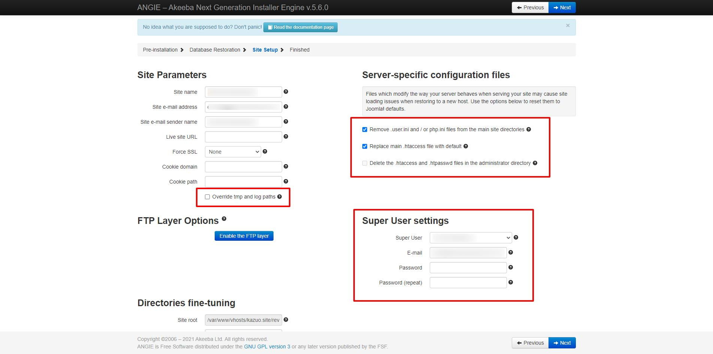
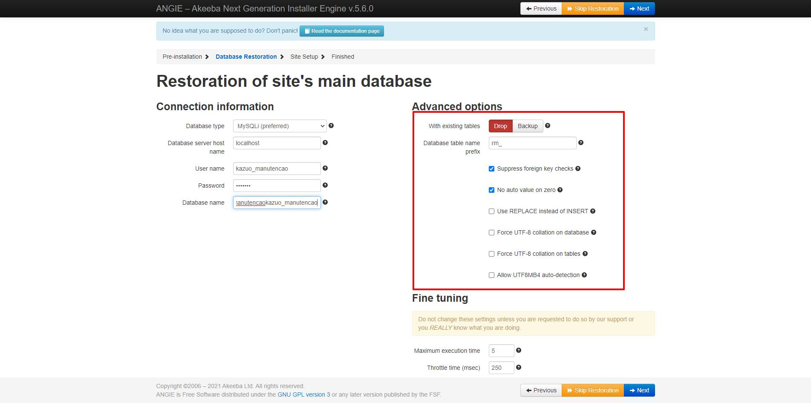

# Descompactando arquivos JPA

JPA - Joomla Pack Archive

Por default o Akeeba Backup gera os backups no formato JPA. Também existe a opção de gerar em ZIP, mas JPA é o método recomendado. Ele dá um pouco mais de trabalho que usando zip, mas nada demais quando entendemos.

## Restaurar o backup de um site feito com o Akeeba

O Kickstart não é um instalador. É uma ferramenta de extração de arquivos. O instalador real foi colocado dentro do arquivo no momento do backup.

O Kickstart sobrescreve os arquivos sem aviso, então não restaure no diretório atual do site, sob pena de que todos sejam sobrescritos e sem aviso.

## Gere o backup do site com o Akeeba Backup

Vou supor que o site está na pasta /var/www/html/site

Geralmente restauramos um site quando acontece algum problema.

Desejamos restaurar um backup de certa data, então, por conta da segurança eu faço assim: renomeio a pasta do site atual para algo como

/var/www/html/sitebk

E crio a pasta

/var/www/html/site

Que é a pasta que o site anterior usava. Assim fica mais cômodo e não precisaremos anterar depois do restore.
Na pasta /var/www/html/site coloco o kickstart.php e o arquivo de backup gerado pelo AkeebaBackup, pois o kickstart restaurará o site na pasta onde ele se encontra.

Download
https://www.akeeba.com/download.html

Arquivo de tradução para pt-br (tecle Ctrl+S para salvar)

[pt-BR.kickstart.ini](https://raw.githubusercontent.com/ribafs/joomla/main/Extensoes/pt-BR.kickstart.ini)

Veja abaixo o original, mas até a última vez que vi estava incompleto:
https://joomlatranslate.com/project/26-akeeba-kickstart

Minha estrutura
```php
/var/www/html/site
	kickstart.php
	pt-BR.kickstart.ini
	site-backup-20210217-191724utc-NlJYJ69GmvopkkQu.jpa
```	
A pasta /var/www/html/site precisa dar permissão de escrita para o servidor web

## Importante

Antes de executar pelo navegador, leia as informações abaixo

Dicas do Kazuo Gomi Filho
Do grupo Joomla Brasil do Facebook

Super User Settings
Realmente vc pode manter os usuarios super users antigos... mas se vc nao lançar os dados novamente, principalmente a senha, o acesso nao será possivel.
o Akeeba vai llimpar a senha do banco de dados.
Dica: o usuario que for setado aqui será o usuario super super super master...
Varias extensoes usam este usuario como parametros.
Entao se esta desenvolvendo para um cliente, cuidado aqui.



Server-scpecif configuration files
Aqui existe outra configuração importante, pois o akeeba pode ou não subsittuir os arquivos htaccess ou php.ini pelos originais
Hospedagem como LOUCAweb inserem no htaccess os handlers quando se altera as versões do php. Alias a versão php padrao da LOUCAweb é a 5.6 ....


Site Parameters
Existe um check importante aqui...
Override tmp and logs path
Marque sempre este item aqui, pois ele corrige eventuais mudanças de caminho para a pasta TMP e LOG
Lembre-se que o akeeba vai usar o site root completo...
No meu caso /var/www/vhosts/meusite.com.br
Se seu site estiver numa pasta ou subdominio este caminho errado pode dar problemas


Restoration of site's main database
Existe uma função que vc pode deletar dados do banco de dados que deseja usar antes de migrar os dados do backup. USE COM CUIDADO
Aqui voce tambem pode corrigir eventuais erros de codificação
utf8-general-ci é o padrao
mas utf8mb4 e o mais novo. Pode não funcionar com todas extensoes, principalmente as mais antigas



O kickstart.php é um descompactador tanto para JPA quanto para ZIP
Em alguns paineis de servidores que não possuem a função descompactar, é bem util.
Dica: em alguns casos, se voce upar o arquivo kickstart.php via ftp. O sistema não irá deixar vc acessa-lo por medidas de segurança.
Basta voce mudar o nome para qualquer coisa que queira... tipo
kickstart.php -> qualquercoisa.php
E ai acessar o seusite.com.br/qualquercoisa
Vai funcionar

Ultima dica...
Se estiver restaurando o backup para testes em outra pasta ou subdominio, altere em configurações globais, i ndex e follow.
Se nao fizer isso.. vc pode estar indexando o conteudo em duplicidade


## Chame pelo navegador (supondo no localhost)

http://localhost/site/kickstart.php

## Selecione o arquivo de backup

Leia a mensagem e tecle Ecs para fechá-la

Archive directory: /var/www/html/site (pasta onde está o kickstart.php)
Arquivo de backup: site-backup-20210217-191724utc-NlJYJ69GmvopkkQu.jpa (arquivo de backup gerado pelo Akeeba)
Senha do arquivo de backup (para arquivos do tipo JPS) - senha do site

Clique em Iniciar

E aguarde a extração dos arquivos

## Restauração e Organização

Clique em Executar o instalador
Veja que ele abriu uma outra aba e manteve a atual aberta.

## Pre-installation check (este já vem do instalador do Akeeba)

Verifique se tem algum problema. Caso não tenha clique em Next

## Restoration of site's main database

É prudente indicar um banco diferente do atual, pois o do site pode estar danificado

Confira e Next

## Database restoration

Clique em Next step

## Site Parameters

Podemos mudar o login e a senha do admin, mas também podemos manter

## Almost there! /Quase lá!

Feche a aba atual para retornar para a tela anterior do Kickstart

## Restauração e Organização

Clique em Organizar

## Acesse o front-end do seu site   Acesse o back-end do seu site

Algo não está funcionando após a restauração? Clique aqui para obter instruções de solução de problemas:

https://www.akeeba.com/documentation/akeeba-kickstart-documentation/post-restoration.html

Agora podemos acessar o site ou o administrator através do respectivo botão

Referência
https://www.cloudweblabs.com/how-to-extract-and-use-jpa-file/

